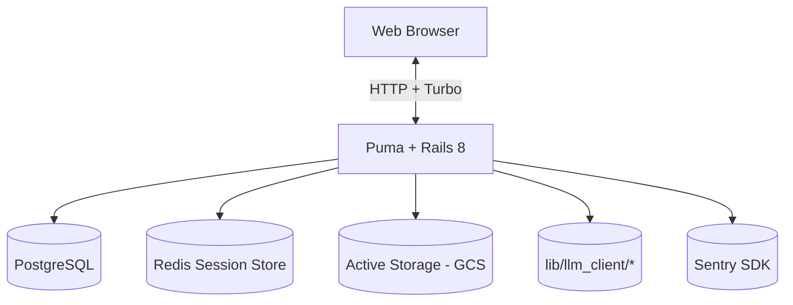
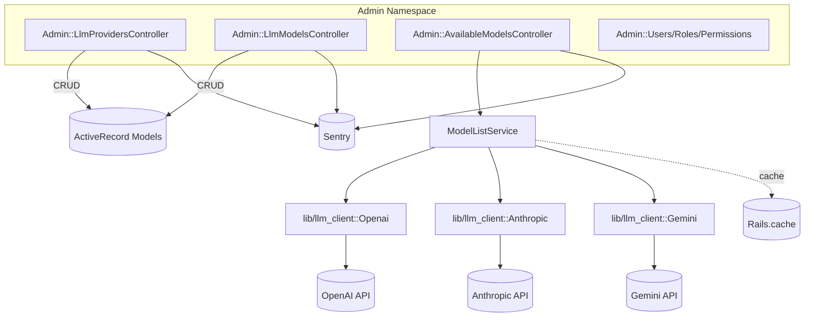

# Repository Guidelines

## Project Structure & Module Organization
- `app/` Ruby on Rails code (controllers, models, views). JS lives in `app/javascript` with Stimulus controllers under `app/javascript/controllers`.
- `config/`, `db/`, `lib/`, `public/` standard Rails dirs; assets in `app/assets`.
- Tests: Ruby in `test/` (unit, system), Playwright e2e in `tests/`.
- Docs and artifacts: `docs/`, `playwright-report/`, logs in `log/`.

## Architecture Overview
- MVC Rails app with Hotwire. Controllers render HTML/Turbo responses; models are Active Record; views use ERB + Turbo.
- Frontend interactions via Stimulus controllers in `app/javascript/controllers` (e.g., `task_controller.js`).
- Persistence: PostgreSQL; file uploads via Active Storage using GCS (`config/storage.yml` profile `google`).
- Sessions/Auth: Redis-backed session store with ActiveRecord fallback (`config/initializers/session_store.rb`), standard login/signup, email verification and password reset, optional TOTP 2FA (`/totp/*`).
- Core domains: `projects` (root), `tasks` with nested `comments`, `assign`, `complete`; admin area manages users, roles, permissions, and LLM providers/models (`admin/*`).
- Integrations: `lib/llm_client/*` wraps OpenAI/Anthropic/Gemini; `ModelListService` caches provider models via `Rails.cache`.
- Observability: Sentry (`sentry-rails`, `sentry-ruby`); health check at `/up`.

## C4 Diagrams
### C1 — System Context
```mermaid
graph LR
  user[Registered User] --> app[Hobo Web App (Rails)]
  admin[Admin] --> app
  app -->|reads/writes| pg[(PostgreSQL)]
  app -->|sessions| redis[(Redis)]
  app -->|files| gcs[(Google Cloud Storage)]
  app -->|errors| sentry[(Sentry)]
  app -->|LLM APIs| llm[(OpenAI / Anthropic / Gemini)]
```

### C2 — Containers


### C3 — Key Components (Rails)
```mermaid
graph TB
  rails[Rails App] --> controllers[Controllers]
  controllers --> views[Views (ERB + Turbo)]
  views --> stimulus[Stimulus (app/javascript/controllers)]
  controllers --> services[Services (ModelListService)]
  controllers --> models[Models (ActiveRecord)]
  models --> db[(PostgreSQL)]
  services --> llmclient[lib/llm_client]
  rails --> sessions[Session Store (Redis/ActiveRecord)]
  rails --> storage[Active Storage]
```

### C3 — Component Deep Dive: Admin + LLM


- Data flow: Admin controllers read/write provider config in PostgreSQL and query available models via `ModelListService`.
- Caching: `Rails.cache` caches model lists per provider/API key to reduce API calls.
- Error handling: API errors are logged and reported to Sentry; UI should surface friendly messages.
- Security: Provider API keys should be stored in credentials or env vars; never commit them.

## Build, Test, and Development Commands
- Setup and start dev server: `bin/setup` (installs gems, prepares DB, runs `bin/dev`).
- Run server only: `bin/dev` or `bin/rails server` (defaults to http://localhost:3000).
- Database: `bin/rails db:prepare` (create/migrate), `bin/rails db:migrate`.
- Ruby tests: `bin/rails test` (all), `bin/rails test:system` (system only).
- Playwright: `npx playwright test` (auto-starts server per `playwright.config.ts`), report with `npx playwright show-report`.
- Lint/format JS: `npm run lint:js`, `npm run lint:js:fix`, `npm run format`, `npm run format:check`.

## Coding Style & Naming Conventions
- Indentation: 2 spaces (Ruby and JS).
- Ruby: follow RuboCop (`.rubocop.yml`): 120-char lines, double quotes, trailing comma on multiline, predicate names avoid `is_`.
- JS: ESLint Standard + Prettier (`.eslintrc.js`, `.prettierrc`): single quotes, no semicolons, `prefer-const`, no `var`, `no-console` warns.
- Naming: Ruby classes `CamelCase`, files `snake_case.rb`; Stimulus controllers `snake_case_controller.js` mapped to `data-controller="snake-case"`.

## Testing Guidelines
- Ruby tests in `test/**`, named `*_test.rb`. Put feature/system tests in `test/system`.
- E2E specs in `tests/**`, named `*.spec.ts`.
- No strict coverage requirement; write focused, fast tests. Use fixtures in `test/fixtures` where helpful.

## Commit & Pull Request Guidelines
- Commits: imperative, present tense, concise (e.g., `Add user form validation`, `Fix RuboCop config`).
- Branches: `feature/<scope>`, `fix/<scope>`, or dependabot-style for deps.
- PRs: clear description, link issues (e.g., `Closes #123`), include screenshots for UI changes, and list test coverage (unit/e2e). Ensure linters/tests pass locally.

## Security & Configuration Tips
- Do not commit secrets. Use Rails credentials (`config/credentials*`, `master.key`) responsibly; prefer environment variables via `.envrc` for local-only values.
- Verify Postgres is available before running `bin/setup`. Avoid committing generated reports and logs.
