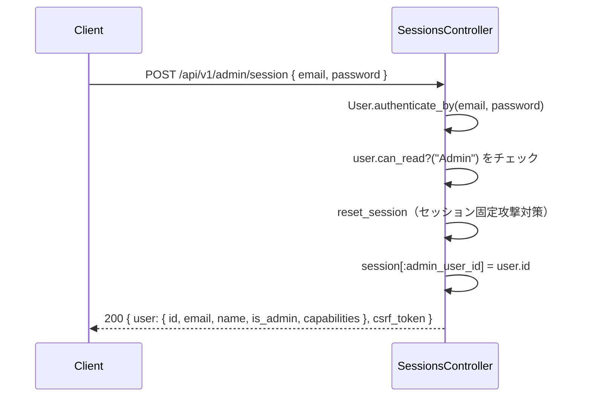
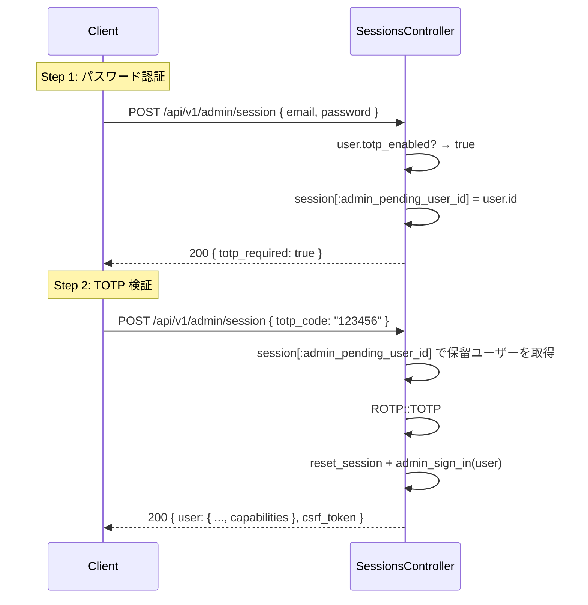

# Admin 認証機能

## 概要

Admin パネルは通常のユーザーセッションとは **独立した専用セッション** で認証を管理します。
2 要素認証（TOTP）、ブルートフォース対策のレートリミット、ログアウト時のセッション分離を備えます。

---

## 関連ファイル

| ファイル | 役割 |
|---------|------|
| `app/controllers/api/v1/admin/sessions_controller.rb` | ログイン / ログアウト API |
| `app/javascript/admin/pages/LoginPage.tsx` | ログインフォーム（TOTP 対応） |
| `app/javascript/admin/contexts/AuthContext.tsx` | セッション状態管理 + CSRF 更新 |
| `test/controllers/api/v1/admin/sessions_controller_test.rb` | ログインシナリオテスト |
| `test/controllers/api/v1/admin/rate_limiting_test.rb` | レートリミットテスト |

---

## エンドポイント

| メソッド | パス | 説明 |
|---------|------|------|
| `POST` | `/api/v1/admin/session` | ログイン（パスワード認証 / TOTP 検証） |
| `GET` | `/api/v1/admin/session` | セッション確認（現在のログイン状態を取得） |
| `DELETE` | `/api/v1/admin/session` | ログアウト |

---

## ログインフロー

### パスワードのみの場合



### TOTP 有効時（2 ステップ）



TOTP ステップでは `email` は送らず、`totp_code` のみ送信します。
コントローラーは `params[:email].blank?` かつ `session[:admin_pending_user_id]` が存在するかどうかで
チャレンジ中かどうかを判定します。

---

## ログインレスポンス構造

```json
{
  "user": {
    "id": 1,
    "email": "admin@example.com",
    "name": "Admin User",
    "is_admin": true,
    "capabilities": {
      "User":        { "read": true,  "write": true,  "delete": true,  "manage": true },
      "Project":     { "read": false, "write": false, "delete": false, "manage": false },
      "Task":        { "read": false, "write": false, "delete": false, "manage": false },
      "Comment":     { "read": false, "write": false, "delete": false, "manage": false },
      "Admin":       { "read": true,  "write": true,  "delete": false, "manage": true },
      "LlmProvider": { "read": true,  "write": true,  "delete": true,  "manage": true }
    }
  },
  "csrf_token": "new-token-after-reset-session"
}
```

> ⚠️ `capabilities` は `user` オブジェクトの **内部にネスト** されています（トップレベルではありません）。

---

## セッション分離

Admin セッションは `session[:admin_user_id]` に格納され、通常のユーザーセッション（`session[:user_id]`）とは分離されています。

| キー | 内容 |
|-----|------|
| `session[:user_id]` | 通常のユーザーログイン |
| `session[:admin_user_id]` | Admin パネルログイン |
| `session[:admin_pending_user_id]` | TOTP チャレンジ中の仮ユーザー ID |

**ログイン時**: `reset_session` でセッション固定攻撃を防ぎ、`session[:user_id]` を明示的に復元します。

```ruby
# app/controllers/api/v1/admin/sessions_controller.rb
def complete_admin_login(user)
  user_id = session[:user_id]        # 通常セッションを退避
  reset_session                       # セッション固定攻撃対策
  session[:user_id] = user_id if user_id  # 通常セッションを復元
  admin_sign_in(user)                 # admin_user_id をセット
  # ...
end
```

**ログアウト時**: 同じ処理で Admin セッションのみクリアし、通常セッションを保持します。

---

## CSRF トークンの更新

`reset_session` を呼ぶと旧トークンが無効になります。Rails がレスポンスに `csrf_token` を含め、
`AuthContext` がすぐに `<meta name="csrf-token">` を更新します。

```tsx
// app/javascript/admin/contexts/AuthContext.tsx
if (result.csrf_token) {
  const meta = document.querySelector<HTMLMetaElement>('meta[name="csrf-token"]')
  if (meta) meta.content = result.csrf_token
}
```

これをしないとログイン後のすべての API コールが `422 CSRF token invalid` で失敗します。

---

## レートリミット（ブルートフォース対策）

**Rack::Attack** により、Admin ログインエンドポイントにレートリミットが設定されています。

| 条件 | 上限 | 単位 |
|-----|------|------|
| 同一 IP からの失敗ログイン | 5 回 | 一定時間内 |
| 同一メールアドレスへの失敗ログイン（IP を問わず） | 5 回 | 一定時間内 |

上限を超えると：
- HTTP ステータス: `429 Too Many Requests`
- レスポンスボディ: `{ "error": "Too many requests" }`
- レスポンスヘッダー: `Retry-After: <秒数>`（整数文字列）

---

## HTTP レスポンスコード

| ステータス | 状況 |
|----------|------|
| `200 OK` | ログイン成功（`{ user, csrf_token }` を返す） |
| `200 OK` | TOTP チャレンジ要求（`{ totp_required: true }` を返す） |
| `204 No Content` | ログアウト成功 |
| `401 Unauthorized` | メール/パスワード不正、TOTP コード不正、未ログイン |
| `429 Too Many Requests` | レートリミット超過 |
