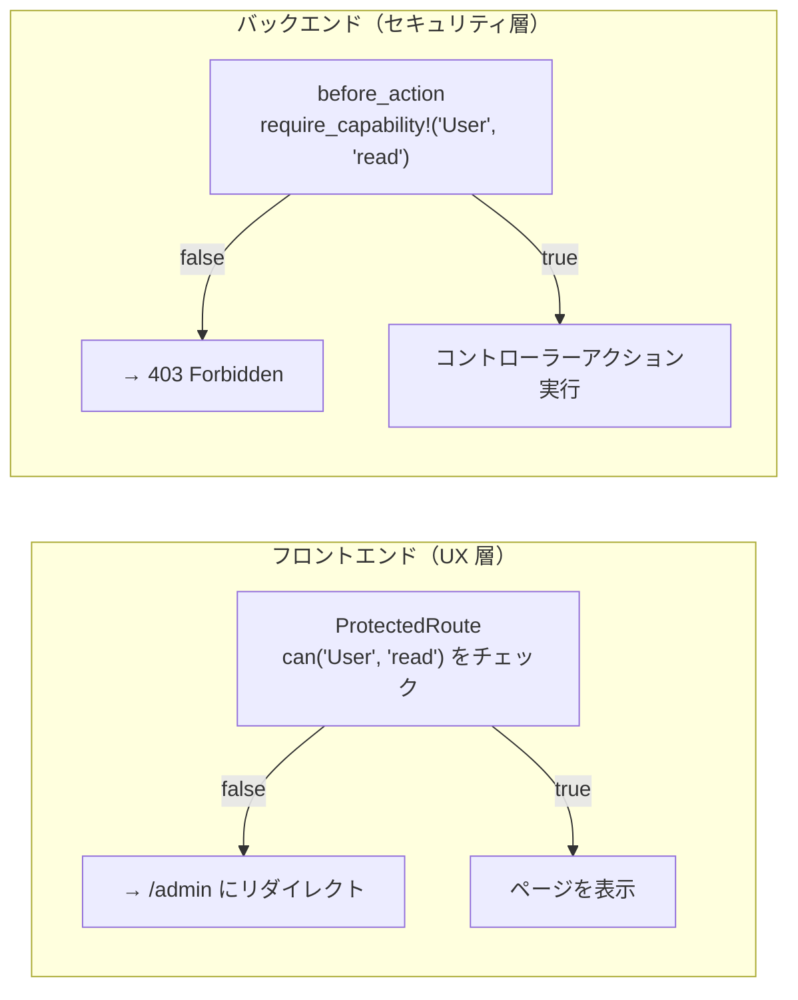

# Admin 認可機能

## 概要

Admin パネルは **ケイパビリティ（Capability）ベースの認可** を採用しています。
認可チェックはフロントエンド（UX）とバックエンド（セキュリティ）の 2 層で実施されます。

---

## 関連ファイル

| ファイル | 役割 |
|---------|------|
| `app/controllers/api/v1/admin/application_controller.rb` | `require_capability!` / `require_manage_access` |
| `app/javascript/admin/components/ProtectedRoute.tsx` | ルートレベルの認可ガード |
| `app/javascript/admin/contexts/AuthContext.tsx` | `can()` / `isAdmin` ヘルパー |

---

## ケイパビリティモデル

ResourceType と Action の組み合わせで権限を表現します。

| ResourceType | read | write | delete | manage |
|-------------|------|-------|--------|--------|
| `User` | ユーザー一覧・詳細 | ユーザー作成・更新 | ユーザー削除 | — |
| `Project` | — | — | — | — |
| `Task` | — | — | — | — |
| `Comment` | — | — | — | — |
| `Admin` | Admin パネルへのアクセス（全員必須） | — | — | — |
| `LlmProvider` | プロバイダー/モデル一覧・詳細 | プロバイダー/モデル作成・更新 | モデル削除 | — |

> `Admin:read` はすべての Admin ユーザーに必須です。これがないと `ApplicationController` で 403 になります。

---

## 2 層認可の構造



**フロントエンドの役割**: 権限のないメニューを隠す・不正なページへの遷移をブロックする（UX）。
**バックエンドの役割**: 実際の API アクセス制御（セキュリティゲート）。フロントを迂回しても防御される。

---

## バックエンド: `require_capability!`

```ruby
# app/controllers/api/v1/admin/application_controller.rb
def require_capability!(resource, action)
  permitted = case action
              when "read"   then current_admin.can_read?(resource)
              when "write"  then current_admin.can_write?(resource)
              when "delete" then current_admin.can_delete?(resource)
              when "manage" then current_admin.can_manage?(resource)
              else false
              end
  render json: { error: "Forbidden" }, status: :forbidden unless permitted
end
```

コントローラーでの使用例:

```ruby
before_action -> { require_capability!("User", "read") }, only: %i[index show]
before_action -> { require_capability!("User", "write") }, only: %i[create update]
before_action -> { require_capability!("User", "delete") }, only: %i[destroy]
```

### `require_manage_access`

ロール管理など、ケイパビリティではなく `is_admin` フラグで保護するリソースに使います。

```ruby
def require_manage_access
  render json: { error: "Forbidden" }, status: :forbidden unless current_admin.admin?
end
```

---

## フロントエンド: `ProtectedRoute` と `can()`

### `ProtectedRoute`

```tsx
// 未ログインは /admin/login へ
<ProtectedRoute>
  <AdminLayout />
</ProtectedRoute>

// ケイパビリティチェック付き
<ProtectedRoute requiredCapability={{ resource: 'User', action: 'read' }}>
  <UsersIndexPage />
</ProtectedRoute>

// is_admin フラグが必要なルート
<ProtectedRoute requireAdmin>
  <RolesIndexPage />
</ProtectedRoute>
```

### `useAuth()` フック

```tsx
const { user, can, isAdmin } = useAuth()

// ケイパビリティチェック
if (can('User', 'write')) { /* 編集ボタンを表示 */ }

// is_admin チェック
if (isAdmin) { /* ロール管理メニューを表示 */ }
```

---

## システムロール

システムロールは `system_role: true` フラグを持つロールで、API からの変更が禁止されています。

| ロール名 | 概要 |
|---------|------|
| `admin` | すべてのリソースへのフルアクセス |
| `user_manager` | User:read / User:write / User:delete を持つ |

システムロールへの保護措置：

- ロールの更新・削除不可（`RolesController` で拒否）
- システムロールへのユーザー割当不可（`UserRolesController` で拒否）
- ユーザーからのシステムロール剥奪不可（`UserRolesController` で拒否）
- システムロールへのパーミッション変更不可（`RolePermissionsController` で拒否）
- `system_role` パラメータはロール作成・更新時に無視される（昇格防止）

---

## 権限昇格防止

### ユーザーへのロール割当時（`UserRolesController`）

割り当てようとするロールが持つパーミッションが、操作者（current_admin）のパーミッションを
超えていれば 403 を返します。

```ruby
def protect_privilege_escalation
  new_permission_ids = RolePermission.where(role_id: role_ids_param).pluck(:permission_id).uniq
  return if new_permission_ids.empty?

  admin_permission_ids = current_admin.roles.joins(:permissions).pluck("permissions.id").uniq
  return if (new_permission_ids - admin_permission_ids).empty?

  render json: { error: "Forbidden" }, status: :forbidden
end
```

### ロールへのパーミッション割当時（`RolePermissionsController`）

割り当てようとするパーミッションが、操作者が持つパーミッションを超えていれば 403 を返します。

```ruby
def protect_permission_escalation
  new_ids = permission_ids_param.compact_blank.map(&:to_i)
  admin_ids = current_admin.roles.joins(:permissions).pluck("permissions.id").uniq
  return if (new_ids - admin_ids).empty?
  render json: { error: "Forbidden" }, status: :forbidden
end
```

---

## HTTP レスポンスコード

| ステータス | 状況 |
|----------|------|
| `401 Unauthorized` | Admin セッションなし、または通常ユーザーセッション |
| `403 Forbidden` | Admin セッションあるが `Admin:read` なし、またはケイパビリティ不足 |
| `403 Forbidden` | システムロール保護・権限昇格防止による拒否 |
