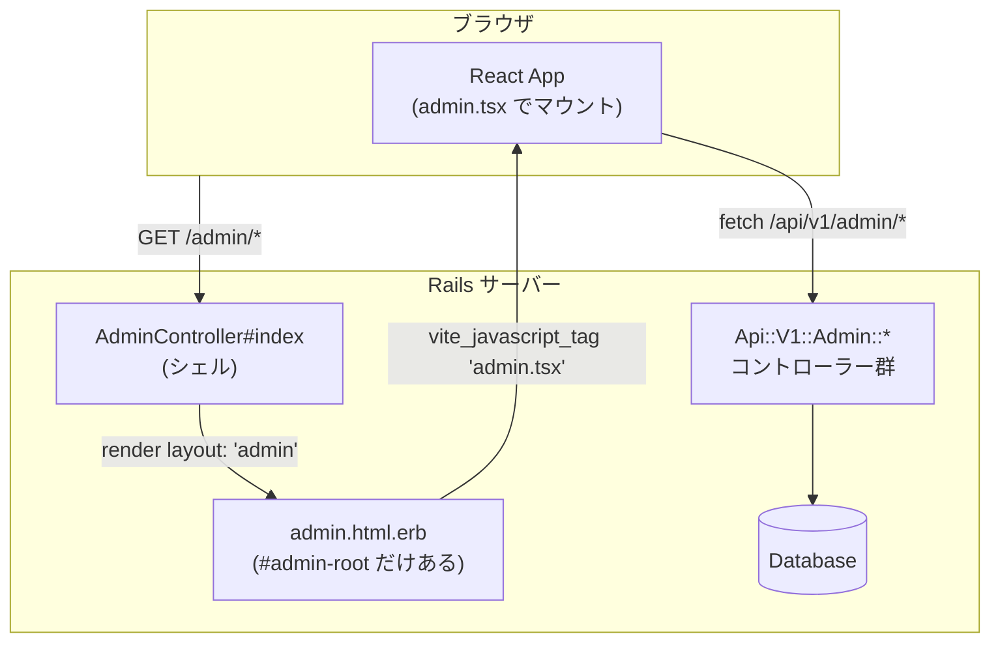
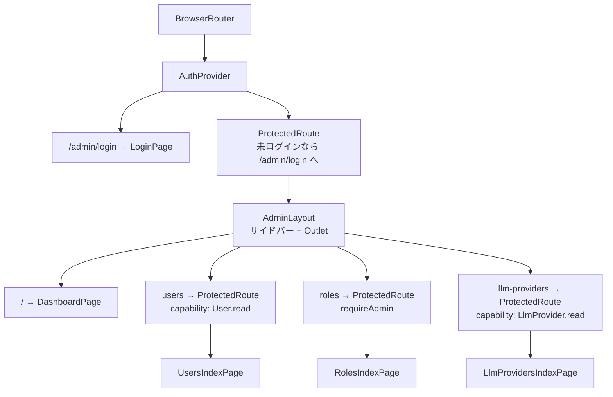
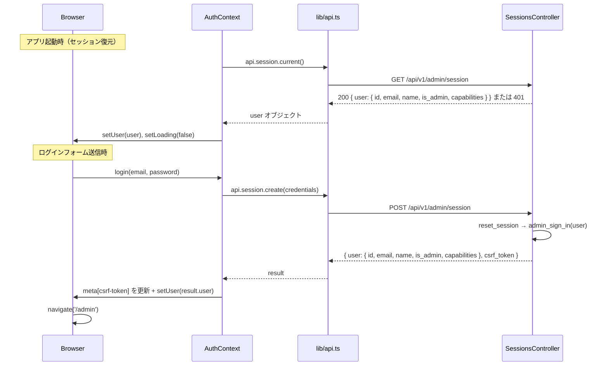
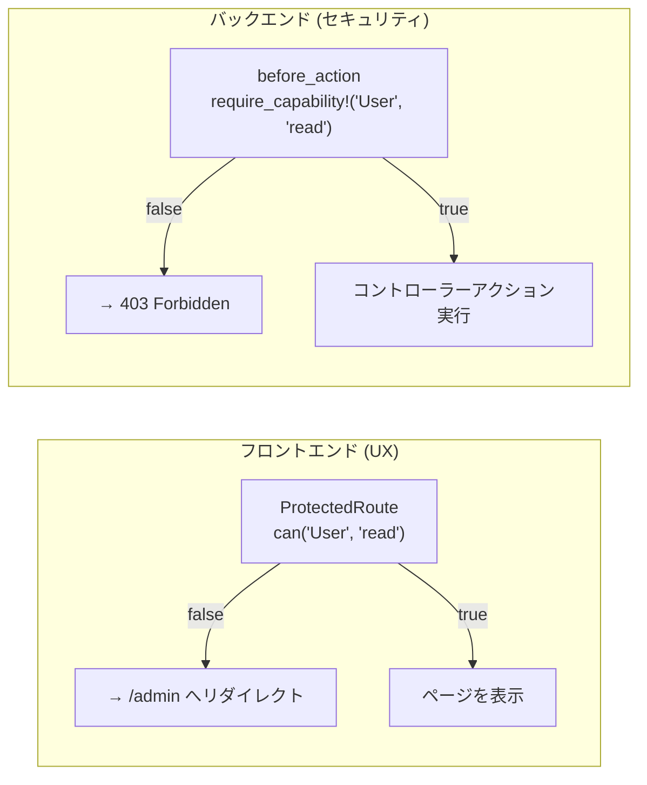

# /admin React SPA オンボーディング

> **Note for AI assistants**: This document is an onboarding tutorial for
> human developers new to the project (Rails engineers learning the React
> SPA). Do NOT load this file for implementation, debugging, or review
> tasks — it contains no authoritative specs. Only reference it when the
> user explicitly asks about learning material or onboarding.

Rails経験者がこのプロジェクトの `/admin` React SPAを読み解くためのガイドです。
「Reactチュートリアルは終わらせた」レベルを前提に、実際のコードを追いながら
**Railsの知識を足場にして** React SPAの構造を理解することを目的としています。

---

## 1. アーキテクチャ全体像

まずは一番大事なメンタルモデルを確立しておきましょう。



**ポイント**: Railsは1枚のHTMLシェル（ほぼ空のページ）を返すだけです。
以降のページ遷移・データ取得はすべてReactとJSON APIが担います。
**Hotwire/Turboはここでは使いません**。

---

## 2. エントリーポイント: RailsからReactへの引き継ぎ

コードを読む起点として、この4つのファイルを順番に追ってみましょう。

### Step 1: ルーティング (`config/routes.rb`)

```ruby
# Admin SPA shell
get "/admin", to: "admin#index", as: :admin_root
get "/admin/*path", to: "admin#index"   # ← キャッチオールルート
```

`/admin/*path` のキャッチオールが重要です。ブラウザで `/admin/users/42/edit` に
直接アクセスしたとき、Railsはその URL の意味を知りません。
Rails はとにかく同じシェルページを返し、React Router がクライアント側で処理します。

> ⚠️ **Gotcha**: このキャッチオールがないと、ブラウザリロードやブックマークからの
> 直接アクセス時に 404 になります。

### Step 2: シェルコントローラー (`app/controllers/admin_controller.rb`)

```ruby
class AdminController < ApplicationController
  skip_before_action :require_login      # ← 通常のRailsセッション認証をスキップ
  before_action :require_admin_session   # ← 独自の管理者セッションチェック

  def index
    render layout: "admin"              # ← 専用レイアウトを使う
  end
  # ...
end
```

`skip_before_action :require_login` に注目してください。
メインアプリの認証 (`session[:user_id]`) とは **別のセッション** で管理者認証を管理しています。
これにより、一般ユーザーとしてログインしたまま管理者としてもログインできます。

### Step 3: レイアウト (`app/views/layouts/admin.html.erb`)

```erb
<head>
  <%= csrf_meta_tags %>    <!-- ← CSRFトークンをmetaタグに埋め込む（後述） -->
  <%= vite_javascript_tag 'admin.tsx' %>  <!-- ← ReactアプリをViteでロード -->
</head>
<body>
  <%= yield %>             <!-- ← ここには <div id="admin-root"></div> だけ入る -->
</body>
```

`application.html.erb` がERBテンプレートをyieldするのと違い、
このレイアウトはJavaScriptアプリのマウントポイントをyieldするだけです。

### Step 4: Reactのエントリーポイント (`app/javascript/entrypoints/admin.tsx`)

```tsx
const container = document.getElementById('admin-root')
if (container) {
  createRoot(container).render(
    <StrictMode>
      <App />
    </StrictMode>
  )
}
```

`#admin-root` を見つけてReactアプリをマウントします。ここからReactの世界になります。

---

## 3. ルーティング: RailsとReact Routerの対比

Railsの `config/routes.rb` に相当するものが、Reactでは `App.tsx` です。

### 対比表

| Rails | React Router (`App.tsx`) |
|-------|--------------------------|
| `config/routes.rb` | `App.tsx` の `<Route>` |
| `resources :users` | `<Route path="users" element={<UsersIndexPage />} />` |
| `params[:id]` | `useParams<{ id: string }>()` |
| `redirect_to admin_root_path` | `<Navigate to="/admin" replace />` |
| `layout "admin"` | `<Route element={<AdminLayout />}>` + `<Outlet />` |
| `namespace :admin` | `<Route path="/admin" ...>` 以下にネスト |
| `link_to "Users", users_path` | `<Link to="/admin/users">Users</Link>` |

### App.tsx のルートツリー



> ⚠️ **DashboardPage の注意**: DashboardPage は `dashboardApi` に加えて `llmProvidersApi.list()` も呼んでいます。
> `LlmProvider:read` 権限がないと LLM プロバイダー件数が取得できません。
> ダッシュボードは `ProtectedRoute` での権限チェックがない（ログインのみ必須）ため、この暗黙の依存に注意してください。

### 全 SPA ルート一覧

`App.tsx` に定義されているすべてのルートを以下に示します。

| パス | ページコンポーネント | 必要権限 |
|-----|-------------------|---------|
| `/admin/login` | `LoginPage` | なし（公開） |
| `/admin` | `DashboardPage` | ログイン済み |
| `/admin/users` | `UsersIndexPage` | `User:read` |
| `/admin/users/new` | `UserNewPage` | `User:write` |
| `/admin/users/:id/edit` | `UserEditPage` | `User:write` |
| `/admin/users/:id/roles` | `UserRolePage` | `User:read` |
| `/admin/roles` | `RolesIndexPage` | `requireAdmin`（`is_admin` フラグ） |
| `/admin/roles/new` | `RoleNewPage` | `requireAdmin` |
| `/admin/roles/:id/edit` | `RoleEditPage` | `requireAdmin` |
| `/admin/roles/:id/permissions` | `RolePermissionPage` | `requireAdmin` |
| `/admin/permissions` | `PermissionsIndexPage` | `requireAdmin` |
| `/admin/permissions/:id` | `PermissionDetailPage` | `requireAdmin` |
| `/admin/llm-providers` | `LlmProvidersIndexPage` | `LlmProvider:read` |
| `/admin/llm-providers/:id` | `LlmProviderDetailPage` | `LlmProvider:read` |
| `/admin/llm-providers/:id/edit` | `LlmProviderEditPage` | `LlmProvider:write` |
| `/admin/llm-providers/:id/models` | `LlmModelsIndexPage` | `LlmProvider:read` |
| `/admin/llm-providers/:id/models/new` | `LlmModelNewPage` | `LlmProvider:write` |
| `/admin/llm-providers/:id/models/:modelId/edit` | `LlmModelEditPage` | `LlmProvider:write` |

> 💡 **`<Outlet />`**: ネストされたルートのレンダリング先です。
> ERBレイアウトの `<%= yield %>` とまったく同じ役割です。
> `AdminLayout` の `<main>` 部分に `<Outlet />` があり、アクティブなページがそこに表示されます。

---

## 4. 認証フロー

認証は複数のレイヤーにまたがるため、シーケンス図で全体を把握しましょう。



### CSRF トークンの更新（重要）

`reset_session` を呼ぶと古いセッションが無効化され、CSRFトークンも変わります。
そのため、ログイン成功時にRailsが新しいトークンをJSONで返し、
`AuthContext` がすぐ `<meta>` タグを書き換えます。

```tsx
// app/javascript/admin/contexts/AuthContext.tsx
const login = async (email: string, password: string, totpCode?: string) => {
  const result = await api.session.create({ email, password, totp_code: totpCode })
  if (!result.totp_required) {
    setUser(result.user)
    if (result.csrf_token) {
      // ← ここでCSRFトークンを更新する
      const meta = document.querySelector<HTMLMetaElement>('meta[name="csrf-token"]')
      if (meta) meta.content = result.csrf_token
    }
  }
  return { totpRequired: result.totp_required }
}
```

> ⚠️ **Gotcha**: これを忘れると、ログイン後のすべてのAPIコールが
> `422 Unprocessable Entity (CSRF token invalid)` で失敗します。

---

## 5. AuthContext: Reactにおける `current_user`

`AuthContext` は Rails の `ApplicationController` における `current_user` ヘルパーに相当します。

### 対比表

| Rails | React |
|-------|-------|
| `current_user` メソッド | `useAuth().user` |
| `before_action :require_login` | `<ProtectedRoute>` コンポーネント |
| `logged_in?` | `user !== null` |
| `session[:admin_user_id]` | `AuthProvider` 内の `user` state |
| 毎リクエストでCookieからセッション復元 | マウント時の `useEffect` で `/api/v1/admin/session` を呼ぶ |

### なぜ起動時にAPIを呼ぶのか

```tsx
// app/javascript/admin/contexts/AuthContext.tsx
useEffect(() => {
  api.session.current()         // ← Railsが session[:admin_user_id] を参照
    .then(({ user }) => setUser(user))
    .catch(() => setUser(null))
    .finally(() => setLoading(false))
}, [])                          // ← [] = マウント時に一度だけ実行
```

**Reactのstateはインメモリ**です。ページをハードリフレッシュすると消えます。
この `useEffect` がRailsの「Cookieのセッションから毎リクエスト `current_user` を復元する」
処理と同等の役割を果たしています。

### `useAuth()` フックで使う

```tsx
// 任意のコンポーネントから current_user 相当にアクセスできる
const { user, can, isAdmin } = useAuth()

// Rails: current_user.can_read?("User")
// React:
if (can('User', 'read')) { ... }
```

---

## 6. APIクライアント: `lib/api.ts`

`lib/api.ts` はすべてのAPIコールの窓口です。

### 3つのポイント

**① CSRFトークンの自動付与**

```ts
// app/javascript/admin/lib/api.ts
const getCsrfToken = (): string => {
  const meta = document.querySelector<HTMLMetaElement>('meta[name="csrf-token"]')
  return meta?.content ?? ''
}

const apiRequest = async <T>(path: string, options: RequestInit = {}): Promise<T> => {
  const response = await fetch(`/api/v1/admin${path}`, {
    ...options,
    headers: {
      'Content-Type': 'application/json',
      'X-CSRF-Token': getCsrfToken(),   // ← 自動的に付与
      ...options.headers,
    },
  })
  // ...
}
```

Rails の `protect_from_forgery with: :exception` が非GETリクエストにこのヘッダーを要求します。

**② ベースURLの統一**

すべてのリクエストは `/api/v1/admin` を起点とします。
`usersApi.list()` は内部で `/api/v1/admin/users` に GET リクエストを送ります。

**③ TypeScript型とRailsレスポンスの対応**

```ts
// lib/api.ts に定義された型
export interface User {
  id: number
  email: string
  name: string
  created_at: string
  updated_at: string
}
```

これはRailsの `UsersController` が `as_json` で返すフィールドと一致している必要があります。
コントローラーのレスポンスにフィールドを追加したら、この型定義も更新してください。

> ⚠️ **Gotcha**: `DELETE` エンドポイントは `head :no_content`（レスポンスボディなし）を返します。
> `response.json()` を呼ぶとエラーになるため、`api.ts` には以下のガードがあります:
> ```ts
> if (response.status === 204) return undefined as T
> ```

---

## 7. ページコンポーネントの解剖

`UserEditPage.tsx` を例に、Railsとの対比でReactページの構造を理解しましょう。

### Rails側（参考）

```ruby
# app/controllers/api/v1/admin/users_controller.rb
class UsersController < ApplicationController
  before_action :set_user, only: [:show, :edit, :update]

  def edit; end    # → @user が view に渡される

  def update
    if @user.update(user_params)
      redirect_to admin_users_path
    else
      flash.now[:error] = @user.errors.full_messages.first
      render :edit
    end
  end

  private
    def set_user
      @user = User.find(params[:id])
    end
end
```

### React側（`app/javascript/admin/pages/users/UserEditPage.tsx`）

```tsx
export const UserEditPage = () => {
  // params[:id] に相当
  const { id } = useParams<{ id: string }>()

  // redirect_to に相当
  const navigate = useNavigate()

  // @user.email, @user.name に相当（フォームの state）
  const [email, setEmail] = useState('')
  const [name, setName] = useState('')

  // flash[:error] に相当（コンポーネントローカルな state）
  const [error, setError] = useState('')

  // before_action :set_user に相当（マウント時にデータ取得）
  useEffect(() => {
    usersApi.get(Number(id))
      .then(user => {
        setEmail(user.email)
        setName(user.name)
      })
      .catch(err => setError(err.message))
  }, [id])    // ← id が変わったら再実行（before_action の毎リクエスト実行に相当）

  // update アクションに相当
  const handleSubmit = async (e: React.FormEvent) => {
    e.preventDefault()    // ← フォームのデフォルト送信（ページリロード）を防ぐ
    try {
      await usersApi.update(Number(id), { email, name })
      navigate('/admin/users')    // ← redirect_to admin_users_path
    } catch (err) {
      setError(err instanceof Error ? err.message : 'Failed to update user')
    }
  }

  return (
    <form onSubmit={handleSubmit}>
      <input value={email} onChange={e => setEmail(e.target.value)} />
      {/* ... */}
    </form>
  )
}
```

### 対比まとめ

| Rails | React (`UserEditPage.tsx`) |
|-------|---------------------------|
| `params[:id]` | `useParams<{ id: string }>()` |
| `before_action :set_user` | `useEffect(() => { usersApi.get(id) }, [id])` |
| `@user.email = ...` (インスタンス変数) | `useState('')` で各フィールドを管理 |
| `form_with model: @user` | controlled input + useState |
| `redirect_to users_path` | `navigate('/admin/users')` |
| `flash[:error]` | `const [error, setError] = useState('')` |

> ⚠️ **Gotcha**: `e.preventDefault()` を忘れると、フォームのHTMLデフォルト動作
> （GETまたはPOSTでページ遷移）が走ってしまい、APIコールではなくページリロードが起きます。

---

## 8. 認可: フロントとバックの二重チェック

認可チェックはフロントとバックの両方で行われています。



**フロントエンドのチェックはUXのためだけです。** ナビから不要なメニューを隠したり、
権限のないページへの遷移を素早くブロックするためのものです。

**実際のセキュリティゲートはバックエンド**の `require_capability!` です。

```ruby
# app/controllers/api/v1/admin/application_controller.rb
def require_capability!(resource, action)
  permitted = case action
              when "read"   then current_admin.can_read?(resource)
              when "write"  then current_admin.can_write?(resource)
              when "delete" then current_admin.can_delete?(resource)
              when "manage" then current_admin.can_manage?(resource)
              else false
              end
  render json: { error: "Forbidden" }, status: :forbidden unless permitted
end
```

### サイドバーナビのフィルタリング

`AdminLayout.tsx` はログインユーザーの権限に応じてナビ項目を絞り込みます。
ERBナビの `<% if current_user.can_read?("User") %>` と同じ発想です。

```tsx
// app/javascript/admin/components/AdminLayout.tsx
section.items.filter((item) =>
  !item.requiredCapability || can(item.requiredCapability.resource, item.requiredCapability.action)
)
```

---

## 9. 新機能の追加手順

`CLAUDE.md` に定義されている手順を「Settings機能追加」を例に具体化します。

### チェックリスト

```
□ 1. Railsコントローラーを作成
     app/controllers/api/v1/admin/settings_controller.rb

□ 2. ルートに追加
     config/routes.rb の namespace :admin ブロック内

□ 3. TypeScript型とAPI関数を追加
     app/javascript/admin/lib/api.ts

□ 4. ページコンポーネントを作成
     app/javascript/admin/pages/settings/SettingsPage.tsx

□ 5. App.tsx にルートを登録
     app/javascript/admin/App.tsx

□ 6. AdminLayout.tsx にナビ項目を追加
     app/javascript/admin/components/AdminLayout.tsx

□ 7. テストを書く
     test/controllers/api/v1/admin/settings_controller_test.rb
```

### 各ステップの詳細

**Step 1: コントローラー**

```ruby
# app/controllers/api/v1/admin/settings_controller.rb
module Api
  module V1
    module Admin
      class SettingsController < ApplicationController
        before_action -> { require_capability!("Admin", "manage") }

        def index
          render json: { ... }
        end
      end
    end
  end
end
```

**Step 2: ルート**

```ruby
# config/routes.rb
namespace :api do
  namespace :v1 do
    namespace :admin do
      # ...既存のルート...
      resources :settings, only: %i[index show update]
    end
  end
end
```

**Step 3: 型定義とAPI関数**

```ts
// app/javascript/admin/lib/api.ts

// 型定義を追加
export interface Setting {
  id: number
  key: string
  value: string
}

// API関数を追加
export const settingsApi = {
  list: () => api.get<Setting[]>('/settings'),
  get: (id: number) => api.get<Setting>(`/settings/${id}`),
  update: (id: number, data: Partial<Setting>) => api.patch<Setting>(`/settings/${id}`, { setting: data }),
}
```

**Step 4: ページコンポーネント**

`UsersIndexPage.tsx` を参考にして作成します。

**Step 5: ルート登録**

```tsx
// app/javascript/admin/App.tsx
import { SettingsPage } from './pages/settings/SettingsPage'

// <Route path="/admin" ...> の中に追加
<Route path="settings" element={
  <ProtectedRoute requiredCapability={{ resource: 'Admin', action: 'manage' }}>
    <SettingsPage />
  </ProtectedRoute>
} />
```

**Step 6: ナビ追加**

```tsx
// app/javascript/admin/components/AdminLayout.tsx
const navSections = [
  {
    label: 'NAVIGATION',
    items: [
      // ...既存のアイテム...
      {
        to: '/admin/settings',
        label: 'Settings',
        requiredCapability: { resource: 'Admin' as ResourceType, action: 'manage' as Action },
        icon: <SettingsIcon />,
      },
    ],
  },
]
```

**Step 7: テスト** (必須シナリオ)

```ruby
# test/controllers/api/v1/admin/settings_controller_test.rb
class SettingsControllerTest < ActionDispatch::IntegrationTest
  test "未認証の場合は 401" do
    get api_v1_admin_settings_path, as: :json
    assert_response :unauthorized
  end

  test "一般ユーザーは 401" do
    login_as_user_api
    get api_v1_admin_settings_path, as: :json
    assert_response :unauthorized
  end

  test "権限不足の管理者は 403" do
    login_as_admin_api_read_only   # Admin:manage がない
    get api_v1_admin_settings_path, as: :json
    assert_response :forbidden
  end

  test "適切な権限があれば 200" do
    login_as_admin_api             # Admin:manage がある
    get api_v1_admin_settings_path, as: :json
    assert_response :ok
  end
end
```

---

## 10. ファイルマップ（クイックリファレンス）

| ファイル | 役割 | Railsにおける相当物 |
|---------|------|--------------------|
| `config/routes.rb` (L38-40) | SPAシェルのルーティング | `config/routes.rb` |
| `app/controllers/admin_controller.rb` | SPAシェルを返す | 通常のコントローラー |
| `app/views/layouts/admin.html.erb` | Reactのマウントポイント | `app/views/layouts/application.html.erb` |
| `app/javascript/entrypoints/admin.tsx` | Reactのエントリーポイント | - |
| `app/javascript/admin/App.tsx` | ルーティング設定 | `config/routes.rb` |
| `app/javascript/admin/contexts/AuthContext.tsx` | 認証状態管理 | `ApplicationController#current_user` |
| `app/javascript/admin/lib/api.ts` | APIクライアント + 型定義 | `routes.rb` + モデルの `as_json` |
| `app/javascript/admin/components/ProtectedRoute.tsx` | ルートレベルの認可 | `before_action :require_login` |
| `app/javascript/admin/components/AdminLayout.tsx` | サイドバー + レイアウト | `app/views/layouts/admin.html.erb` |
| `app/javascript/admin/pages/` | 各ページコンポーネント | コントローラーアクション + ビュー |
| `app/controllers/api/v1/admin/application_controller.rb` | APIの基底コントローラー | `ApplicationController` |
| `app/controllers/api/v1/admin/sessions_controller.rb` | ログイン/ログアウト | Deviseの `SessionsController` 相当 |
| `test/controllers/api/v1/admin/` | APIコントローラーテスト | `test/controllers/` |

---

## 参考: よく使うパターン早見表

### 現在のユーザー情報を使う

```tsx
const { user, can, isAdmin } = useAuth()

// ユーザー名を表示
<span>{user?.name}</span>

// 権限チェック
{can('User', 'write') && <button>Edit</button>}
```

### ページロード時にデータ取得

```tsx
const [items, setItems] = useState<User[]>([])
const [loading, setLoading] = useState(true)

useEffect(() => {
  usersApi.list()
    .then(setItems)
    .catch(err => setError(err.message))
    .finally(() => setLoading(false))
}, [])
```

### フォーム送信

```tsx
const handleSubmit = async (e: React.FormEvent) => {
  e.preventDefault()   // 必須！
  try {
    await usersApi.create({ email, name, password })
    navigate('/admin/users')
  } catch (err) {
    setError(err instanceof Error ? err.message : 'Error')
  }
}
```

### URLパラメータを取得

```tsx
// /admin/users/:id/edit
const { id } = useParams<{ id: string }>()
const userId = Number(id)
```

---

## 各機能の詳細ドキュメント

各機能のエンドポイント一覧・セキュリティ制約・実装詳細は `docs/features/` 配下のファイルを参照してください。

| ドキュメント | 内容 |
|------------|------|
| [`docs/features/ADMIN_AUTHENTICATION.md`](../features/ADMIN_AUTHENTICATION.md) | ログインフロー・TOTP 2FA・セッション分離・レートリミット |
| [`docs/features/ADMIN_AUTHORIZATION.md`](../features/ADMIN_AUTHORIZATION.md) | ケイパビリティモデル・2層認可・システムロール保護・権限昇格防止 |
| [`docs/features/ADMIN_USER_MANAGEMENT.md`](../features/ADMIN_USER_MANAGEMENT.md) | ユーザー CRUD・ロール割当・自己削除防止 |
| [`docs/features/ADMIN_ROLE_MANAGEMENT.md`](../features/ADMIN_ROLE_MANAGEMENT.md) | ロール CRUD・システムロール保護・パーミッション割当 |
| [`docs/features/ADMIN_PERMISSION_MANAGEMENT.md`](../features/ADMIN_PERMISSION_MANAGEMENT.md) | パーミッション一覧・詳細（読み取り専用） |
| [`docs/features/ADMIN_LLM_PROVIDER_MANAGEMENT.md`](../features/ADMIN_LLM_PROVIDER_MANAGEMENT.md) | LLM プロバイダー/モデル管理・API キー秘匿・available_models |
